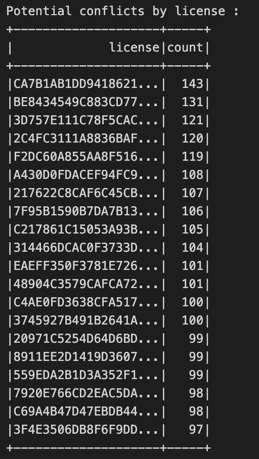
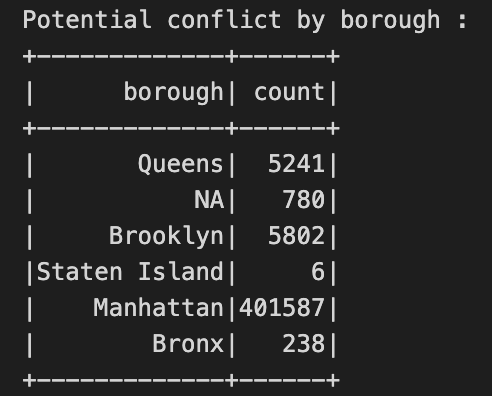
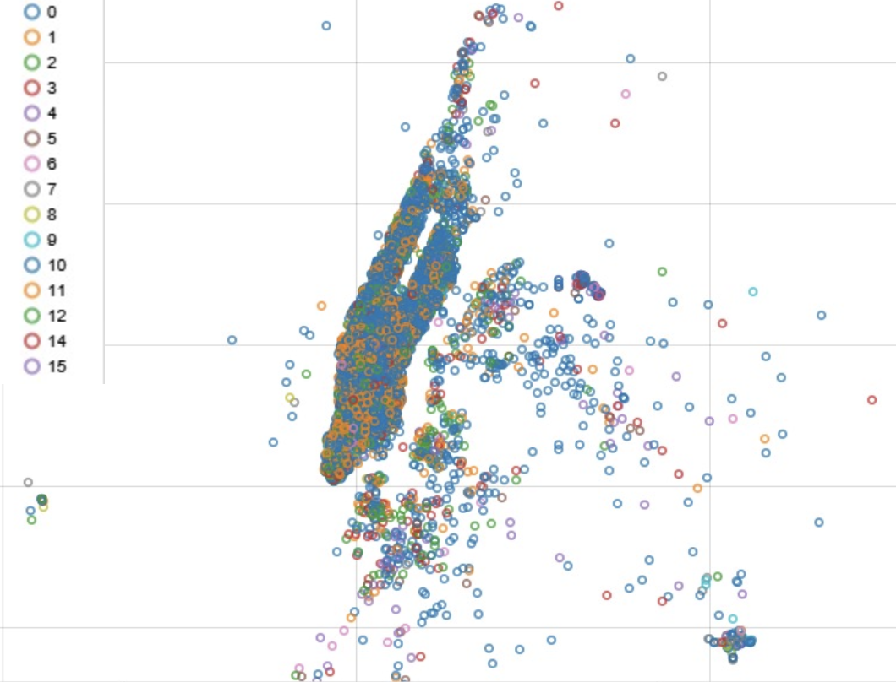

# Geospatial and Temporal Data Analysis on the New York City Taxi Trip DataFile
## Membres de l'équipe

* Capocasale Romain
* Freiburghaus Jonas
* Moulin Vincent

## Questions
### Statistiques descriptives

1. Identifier les temps de trajet court. Ce qui pourrait intérpréter comme une altercation entre les chauffeurs et le clients. Il s'agirait de compter le nombre d'éventuelles altercations par taxi (license).
2. Réaliser des cartes de chaleur en fonction des entrées et sorties du taxi pour tous les taxis. Ceci pourrait par exemple permettre d'identifier les lieux de travail et les domiciles.

### Régression

3. Prédire le tips d'un trajet par rapport aux données géospatiales, au temps et potentiellement d'autres variables

## 1. Description du jeu de données (taille, information contenu)

Les données ont été téléchargées en suivant les liens ci-dessous :

* [Trip Data](http://chriswhong.com/wp-content/uploads/2014/06/nycTaxiTripData2013.torrent)
* [Fare Data](http://chriswhong.com/wp-content/uploads/2014/06/nycTaxiFareData2013.torrent)

Nous avons choisi d'analyser les données pour le mois de janvier 2013.

### Fichier : trip_data_1.csv

En utilisant la commande `du -h trip_data_1.csv`, nous voyons qu'il occupe un volume de 2.3 GB.
Pour un total de 14776616 lignes y compris la ligne d'entête, la commande utilisé est : `wc -l trip_data_1.csv`.
Chaque ligne décrit un trajet.

Il y a 14 variables disponibles par ligne. Ces variables sont : 

* medallion
  * Identifiant d'un permis transférable (véhicule)
  * Variable catégorique
* hack_license
  * Identifiant d'un permis de taxis (chauffeur)
  * Variable catégorique
* vendor_id
  * Identifiant de l'entreprise de Taxi
  * Variable catégorique
  * Il y a 2 entreprises (CMT, VTS) `cat trip_data_1.csv | cut -d ',' -f 3 | sort | uniq -c`
    * CMT: 7450899 lignes
    * VTS: 7325716 lignes
* rate_code
  * Le type de facturation
  * Variable catégorique
  * Il y a 14 types de facturation dans le jeu de données
    * 0: 667 lignes
    * 1: 14456067 lignes
    * 2: 28 lignes
    * 3: 17655 lignes
    * 4: 22831 lignes
    * 5: 39889 lignes
    * 6: 315 lignes
    * 7: 2 lignes
    * 8: 10 lignes
    * 9: 1 ligne
    * 28: 2 lignes
    * 65: 1 ligne
    * 128: 4 lignes
    * 210: 11 lignes
* store_and_fwd_flag
  * Indique si le trajet a été gardé en mémoire avant d'être envoyé au serveur en cas d'absence de réseau
  * Variable catégorique binaire
* pickup_datetime
  * La date et l'heure à partir de laquelle la course commence à être facturée
  * Date, peut être utilisée comme variable continue, cyclique ou catégorique
* dropoff_datetime
  * La date et l'heure à partir de laquelle la course se termine (n'est plus facturée)
  * Date, peut être utilisée comme variable continue, cyclique ou catégorique
* passenger_count
  * Le nombre entier de passagers
  * Nombre entier
* trip_time_in_secs
  * La durée du trajet en seconde
  * Variable continue
* trip_distance
  * La distance du trajet en Miles
  * Variable continue
* pickup_longitude
  * La coordonnée longitude du lieu de départ
  * Variable continue
* pickup_latitude
  * La coordonnée latitude du lieu de départ
  * Variable continue
* dropoff_longitude
  * La coordonnée longitude du lieu d'arrivée
  * Variable continue
* dropoff_latitude
  * La coordonnée latitude du lieu d'arrivée
  * Variable continue

### Fichier: trip_fare_1.csv

Occupe un volume de 1.6 GB en mémoire pour 14776617 lignes.

Il y a 11 variables disponibles par ligne. Ces variables sont :

* medallion
* hack_license
* vendor_id
* pickup_datetime
* payment_type
  * Le type de payement
  * Variable catégorique
* fare_amount
  * Prix uniquement du trajet en fonction du temps et de la distance parcourue
  * Variable continue
* surcharge
  * Surcharge, par exemple s'il y a des valise ou surcharge nocturne
  * Variable continue
* mta_tax
  * Taxe pour la "Metropolitan Transit Authority"
  * Variable continue
* tip_amount
  * Le don
  * Variable continue
* tolls_amount
  * Les payages
  * Variable continue
* total_amount
  * Le coût total du trajet
  * Variable continue

**Remarque**: les 4 premières variables ont la même définition que pour le fichier trip_data_1.csv.

## 2. Description des caractéristiques utilisées et des étapes d'extraction de caractéristiques supplémentaires - Romain

Les principales features utilisées sont : 
    * Date et heure du début de la course - (pickupTime)
    * Date et heure de la fin de la course - (dropoffTime)
    * Identifiant du taxi - (license) 
    * Latitude départ course - (pickupX)
    * Longitude départ course - (pickupY)
    * Latitude arrivée course - (dropoffX)
    * Longitude arrivée course - (dropoffY)
    * Montant du tip - (tipAmount)
    * Prix total course - (totalAmount)
    * Identifiant de l'entreprise de Taxi - (vendorId)
    * Durée trajet en seconde - (tripTimeSecs)
    * Distance du trajet - (tripDistance)
    * Nombre de passagers dans taxi - (passengerCount)
    * Moyen de paiement - (paymentType)
    * Prix du trajet seulement - (fareAmount)
    * Coût supplémentaire - (surcharge)

Les features extraction sont : 
    * extraction des **secondes**, **heures** et **jour de la semaine** à partir des données timestep (pickupTime,dropoffTime)
    * extraction du **quartier de départ** du taxi à partir des coordonnées GPS (pickupX, pickupY)
    * extraction du **quartier d'arrivée** du taxi à partir des coordonnées GPS (dropoffX, dropoffY)
    * Bucketing sur le tipAmount
    * **Calcul du coût d'un taxi** = distance moyenne * coût par Miles
    * **Calcul du gain d'un taxi** = prix total course * coût du taxi
    * **Prix du trajet seulement** = totalAmount - tipAmount

## 3. Questions auxquelles on souhaite obtenir une réponse en utilisant les données

### 3.1 Statistiques descriptives - Vincent

**1.1 Conflits potentiels**

L'idée ici est de détecter de potentiels conflits entre clients taxi. En effet, les taxis quittant Manhattan pour les banlieues sont parfois perdants, car il peut être plus difficile de toruver un client rapidement qui retourne sur Manhattan. De ce fait, certains taxis refusent des clients où leur demandent de sortir une fois que le client a donné sa destination. Cette pratique est cependant interdite, un chauffeur de taxi a l'obligation de prendre en charge un client peut importe sa destination.

On souhaite donc, parmis les données, mettre en évidence les chauffeurs de taxis qui aurait tendance à avoir recours à ces pratiques.

Pour commencer, nous faisons l'hypothèse suivante : les 5% des trajets les plus courts sont potentiellement des cas litigieux. Nous calculons donc le quantile 0.05 sur l'ensemble des temps de trajets à disposition dans les données.

On peut alors à présent faire un select sur sur nos données. On choisit de garder : le temps de trajet en secondes, la licence du taxi ainsi que le quartier. On indique une clause where qui spécifie que nous voulon des temps de trajets entre 0 secondes et la valeur du quartile calculé précédement, qui est de 60 secondes. On termine en groupant les trajets filtrés par licence et on applique un count. Voici le résultat obtenu:

Seuls les 20 premiers résultats, triés dans l'ordre décroissant sont affichés. On peut remarquer que certains chauffeur de taxi, selon le hash de leur licence, pourraient avoir tendance à potentiellement refuser des clients.

On peut ensuite lister le total de conflits potentiels, il est dans notre cas de 413654. On peut ensuite grouper cela par quartier :

On peut donc confirmer le fait que les taxis ont plutôt tendance à refuser des taxis depuis Manhattan. plus de 95% des conflits potentiels se trouvent dans cette zone.

**1.2 Baseline modèle pour le pourboire**

L'idée ici est de définir un modèle Baseline pour l'estimation du pourboire des clients pour les courses de taxis. Ce modèle est simplement la moyenne de tous les pourboires reversé par les clients. Nous allons ensuite appliquer cette moyenne comme prédiction du pourboire de chaque course, pour pouvoir calculer les métriques RMSE et MAE.

Ce modèle est très simple. Il a pour but déjà de décrire le pourboire moyen. Il aura comme objectif également d'avoir une base de travail que l'on pour comparer avec les modèles de regressions qui seront entraînés dans le chapitre 3.2. On pourra voir si nos modèles apprenent et permettent une estimation plus fine que ce modèle Baseline.

Voici les score que nous obtenons :

* **Mean of tip amount** : 1.2630700055188528
* **Baseline RMSE** : 2.019734868621055
* **Baseline MAE** : 1.3081345132729219

Le pourboire moyen est donc d'environ 1,26$.

Nous avons une RMSE et MAE plutôt élevée, ce qui est cohérent vu l faible complexité du modèle. Ces valeurs seront comparées à celles obtenues avec un modèle de ML entraîné.

**1.3 Bucketisation et affichage des données**

Nous allons à présent réaliser un graphe de type Scatter Plot des tips catégorisé. 

A l'aide de la classe ``Buketizer``, nous allons pouvoir catégoriser les tips de moins de 20$ dans N classes. Nous avons dans notre cas décidé de réaliser 15 blocs de tailles égales.

Ces points seront ensuite affichés sur un graphe et la légende sera leur catégorie. Les catégories iront donc de 1 à 15. Plus la valeur d'une classe est basse plus le pourboire est petit, et inversement.

Voici un exemple du graphe:

A noter que les pourboires sont afficher sur le graphe au point de dépôt du client. On voit qu'énormément de pourboire se situent dans la catégorie 1 et 2. Les classes 15 sont peut représentées. On peut cependant en remarquer certains. Ces pourboires assez élevés pourraient provenir d'homme d'affaires qui se rendent soit sur leur lieu de travail pour les points sur Manhattan ou lorsqu'ils rentrent chez eux dans les zone d'habitation situées en dehors de Manhattan.

On peut également noter que le regorupement en bas à droite est l'emplacement de l'aéroport JFK de New York, ce qui explique cette condensation de pourboire à un seul et même endroit, plutôt éloigné des autres.

### 3.2 Machine learning - Romain

La question posée à ce point est : Est t-il possible de prédire le tip qu'un taxi reçoit pour une course avec un modèle de machine learning ?. Le second objectif est de voir si les modèles de machines learning vont obtenir des résultats supérieurs aux scores de la baseline calculé au point précédent. Pour ce point, la librairie Spark ML est utilisée. Comme le tips est une valeur continue, les modèles utilisés devront donc également prédire une valeur continue. Dans ce cas des modèles de régression sont utilisés.

Pour cette phase deux modèles de machines learning ont été utilisés :
    * Régression linéaire
    * Régression avec une forêt aléatoire

Premièrement une RFormula est définie pour indiquer à Spark quel est le label et les features. Dans notre cas les features sont les suivantes, c'est elles qui vont permettre de déterminer le prix du tips: 
    * vendorId
    * tripTimeSecs 
    * tripDistance 
    * passengerCount 
    * paymentType 
    * hour 
    * weekday 
    * dropoffBorough 
    * pickupBorough 
    * fareAmount

Le label est la colonne : tipAmount

Les données sont splittées en jeu d'entraînement et de test avec le ratio suivant :
    * 0.7% entraînement
    * 0.3% test

Pour plus de simplification, un pipeline qui inclut le modèle et la RFormula est créé. 

La classe ParamsBuilder est également utilisé pour pouvoir tuner les hyperparmètres des modèles. Pour la régression les hyperparamètres sont : 
    * elasticNetParam
    * regParam

Pour la forêt aléatoire, les hyperparamètres sont : 
    * maxDepth
    * maxBins

Une recherche par quadrillage est donc effectuée sur ces hyperparamètres pour trouver ceux qui vont donner les meilleurs scores pour un modèle donné.

Le jeu d'entraînement est également séparé en jeu d'entraînement et validation à l'aide de la classe 'TrainValidationSplit' avec un ratio de 0.75%. À cet objet sont également ajouté : 
    * Les différentes hyperparamêtres définies ci-dessus
    * La pipeline
    * Les métriques (RMSE et MAE)

Avec toutes ces différentes étapes définies, le modèle est maintenant prêt à être entraîné à l'aide de la méthode 'fit()'. Les prédictions sur le jeu de test sont ensuite effectuées avec la méthode 'transform()'. Il est a noter que pour rendre les prédictions plus réalistes toutes les valeurs négatives que le modèle a prédites sont ramenées à 0 (max(0, prediction)) car il n'est pas possible qu'un passager d'un taxi donne un tips négatif.

On constate au vu des résultats obtenus au chapitre 7 que le modèle obtiennent des résultats supérieurs à la baseline calcul au point 1. On constate que le modèle avec les meilleurs résultats est la forêt aléatoire avec une MAE de 0.39 et une RMSE 1.05. Donc pour répondre à la question posée en début de chapitre, oui il est possible de construire un modèle de machine learning capable de prédire le prix qui a de meilleur résultats que simplement prendre la moyenne des tips.

### 3.3 Profit des taxis

Pour calculer le profit nous avons cherché le coût total d'appartenance d'une voiture par Mile. Nous avons trouvé ce coût sur le site du ["Bureau of Transportation Statistics"](https://www.bts.gov/content/average-cost-owning-and-operating-automobilea-assuming-15000-vehicle-miles-year). Nous l'avons arrondi à 61 cents.

Nous calculons le coût du trajet comme étant :

$$\text{trip cost} = \text{distance} * \text{cost by miles}$$

Et finalement nous calculons le gain, comme ci-dessous :

$$\text{gain} = \text{total amount} - \text{trip cost}$$

Pour obtenir le profit par conducteur de taxi, nous groupons par licence. L'opération d'aggrégation est une somme.

De manière similaire, nous avons calculé le profit moyen par entreprise et par heure. Nous groupons donc sur 2 colones, en appliquant une moyenne.

Finalement, nous avons calculé le profit moyen par heure et par quartier. Ceci dans le but de savoir quel quartier est le plus profitable et si cela dépend de l'heure. Nous avons donc limité é l'aide d'une instruction `where` ce calcul aux trajets qui partaient d'un quartier et revenaient dans ce même quartier.

## 4. Algorithmes utilisés

Durant ce projet, certains algorithmes de Machine Learning ont été utilisés dans le but de résoudre une problématique sur les données des taxis New Yorkais.

C'est notamment le cas le chapitre 3.2, où différents algorithmes de la librairie Spark ML.

Algorithmes employés:

* Régression Linéaire
* Random Forest Regressor

Ces algorithmes ont été utilisés avec l'aide de différents composants Spark ML. Notamment les pipelines, les grid search et la validation croisée.

Ils ont été évalués avec les métriques RMSE et MAE.

## 5. Optimisations réalisées

Au niveau des optimisations les Dataframe ont été principalement été utilisé à la place des RDD, pour profiter des optimisations fournit par Spark et notamment Catalyst. Au niveau des performances et du temps d'exécution, aucune autre optimisation particulière n'a été mise en place. 

Une optimisation, mais cette fois-ci des performances mises en place est l'utilisation de la recherche per quadrillage pour la question 2 sur le machine learning. Ce processus permet d'optimiser les hyperparamètres utilisés pour maximiser les performances des modèles. 

## 6. Approche de test et d'évaluation

Pour tester des statistiques descriptives simples, comme le nombre de lignes et le type de données, nous avons utilisé les commandes unix dans un terminal. Des exemples sont donnés dans la section 1 de ce rapport. 

Pour évaluer les modèles de régression, nous avons utilisé comme métriques, la racine de l'erreur quadratique moyenne (Root Mean Squared Error (RMSE)).

$$\text{RMSE} = \sqrt{\frac{1}{n} \sum_{i=1}^n \left(\hat{y}_i - y_i \right)^2}$$

Ainsi que la déviation absolue moyenne (Mean Absolute Error (MAE))

$$\text{MAE} = \frac{1}{n} \sum_{i=1}^n |\hat{y}_i - y_i|$$

La déviation absolue moyenne est moins sensible aux valeurs extrêmes.

Afin d'avoir un modèle simple de comparaison, nous avons calculé la valeur moyenne du pourboire comme prédiction. Ainsi nos modèles de régression plus complexes se doivent au moins de faire mieux que la RMSE et le MAE de ce modèle simple.

## 7. Résultats obtenus - Vincent

Nous avons pu, au travers de l'analyse du jeu de données des trajets de taxi de New York, répondre à des questions que nous nous posions sur cette problématique.

Nous avons été capable de :

* Détecter des conflits potentiels entre clients et chauffeurs selon les licences ou par quartier et tirer des conclusions
* Réaliser des modèles capables de prédire le pourboire selon divers charactéristiques
* Visualiser les pourboires selon leur range de prix et tirer des conclusions
* TODO

Les résultats obtenus sont plutôt cohérents et des conclusions logiques peuvent expliquer nos résultats.

## 8. Améliorations possibles

La visualisation de la densité de taxi dans la ville de New York pourrait être améliorée en utilisant une carte de chaleur superposée à un plan de la ville.

Pour la régression, une amélioration serait de considérer la variable catégorique `rate_code` qui a une influence directe sur le prix final et donc potentiellement sur le pourboire. Cependant, certain `rate_code`  ont peu d'exemple dans les données. Il faudrait donc soit les ignorer ou rassembler les `rate_code` rares en une seule catégorie si cela aurait du sens. Pour savoir si cela aurait du sens, nous nécessiterions une définition de ces `rate_code`.

Pour améliorer notre calcul du profit, il serait intéressant d'obtenir le coût par Mile des modèles des véhicules utilisés par les compagnies de taxi. De plus d'autres coûts devraient être pris en compte, tels que les frais administratif, de leur système d'information, des assurances, des licenses et certainement d'autres frais. Il s'agirait ensuite de trouver une formuler pour ajouter pour obtenir ces frais par Miles. Ce qui n'est pas une tâche facile.
